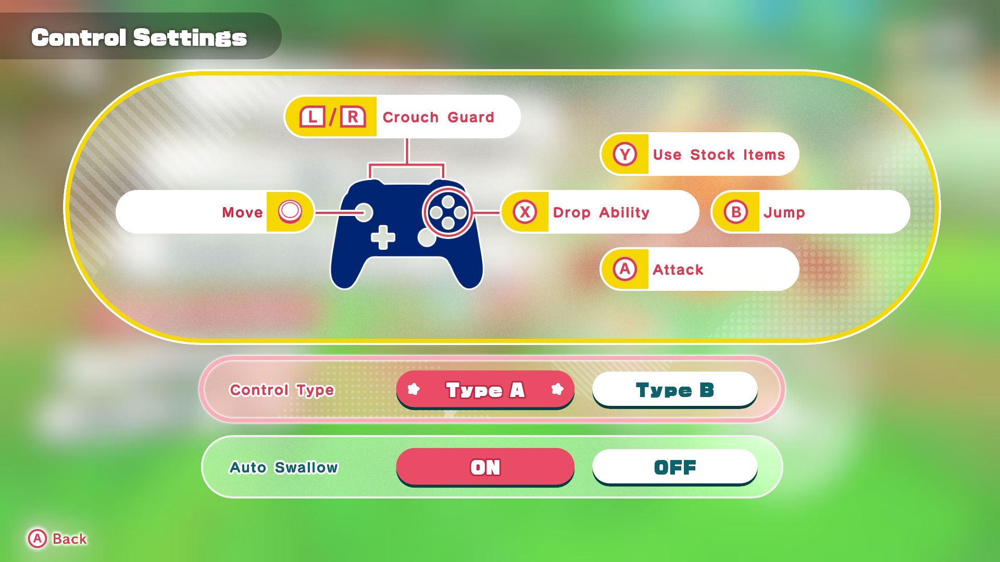

# Kirby and the Forgotten Land: Simple Xbox Icons

A mod that replaces the default Nintendo Switch button prompts with Xbox-style icons in **Kirby and the Forgotten Land**. Perfect for anyone playing with an Xbox controller on emulator.



## About

Previously, only a [PlayStation icon mod](https://gamebanana.com/mods/500049) existed for this game - now Xbox players can enjoy proper button prompts too!

The mod swaps the Nintendo face button icons (A/B/X/Y) with their Xbox equivalents, so on-screen prompts match the physical layout of your Xbox controller.

## Download

- 🍌 **[GameBanana](https://gamebanana.com/mods/657503)** _(primary)_
- 📦 **[GitHub Releases](https://github.com/SavageCore/kfl-simple-xbox-icons/releases)**

## Installation

1. Download the latest release.
2. Extract the mod folder into your emulator's mod directory:

   ```
   Simple Xbox Icons/romfs/lyt/Cmn/BtnIcon/Parts.arc.cmp
   ```

3. Enable the mod in your emulator and launch the game.

## Want to Make Your Own?

Check out the **[Icon Swap Guide](guides/GUIDE.md)** for a step-by-step walkthrough on how to mod the controller UI prompts yourself.

## Credits

- Original concept from [Simple Xbox Icons (Mario Kart 8 Deluxe)](https://gamebanana.com/mods/519989)
- [firubii](https://gamebanana.com/questions/44756) for explaining how to swap the button textures
