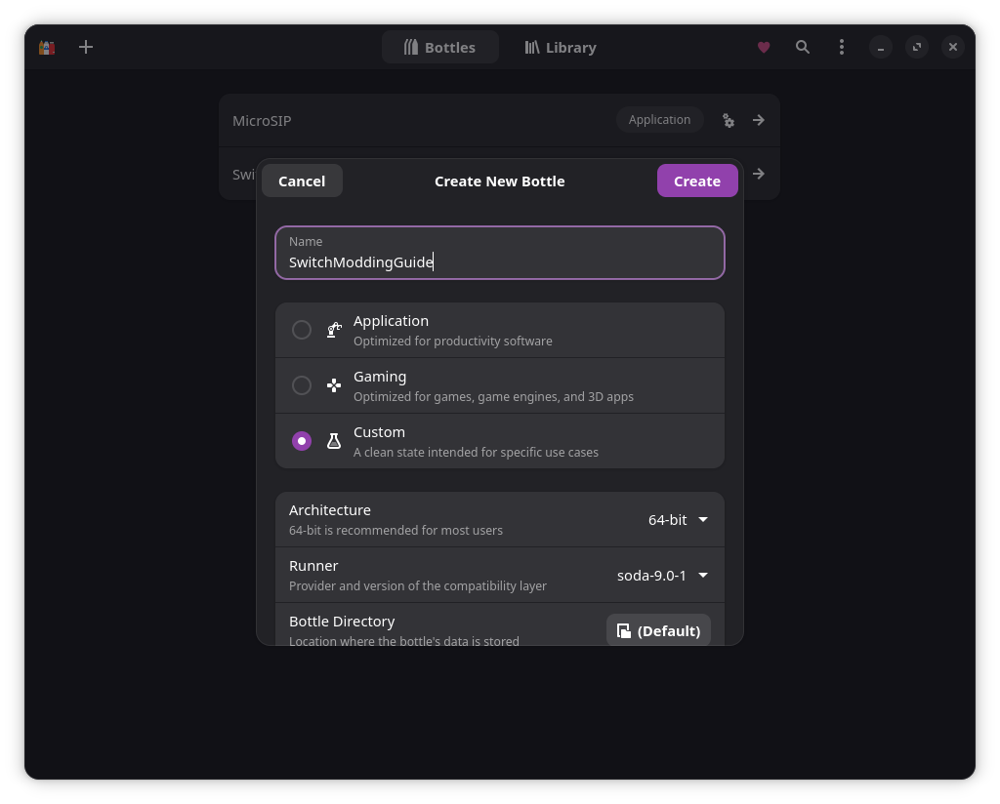
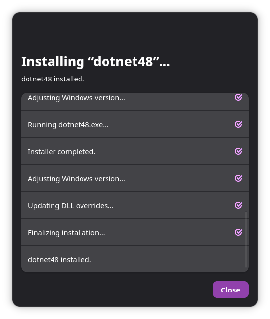
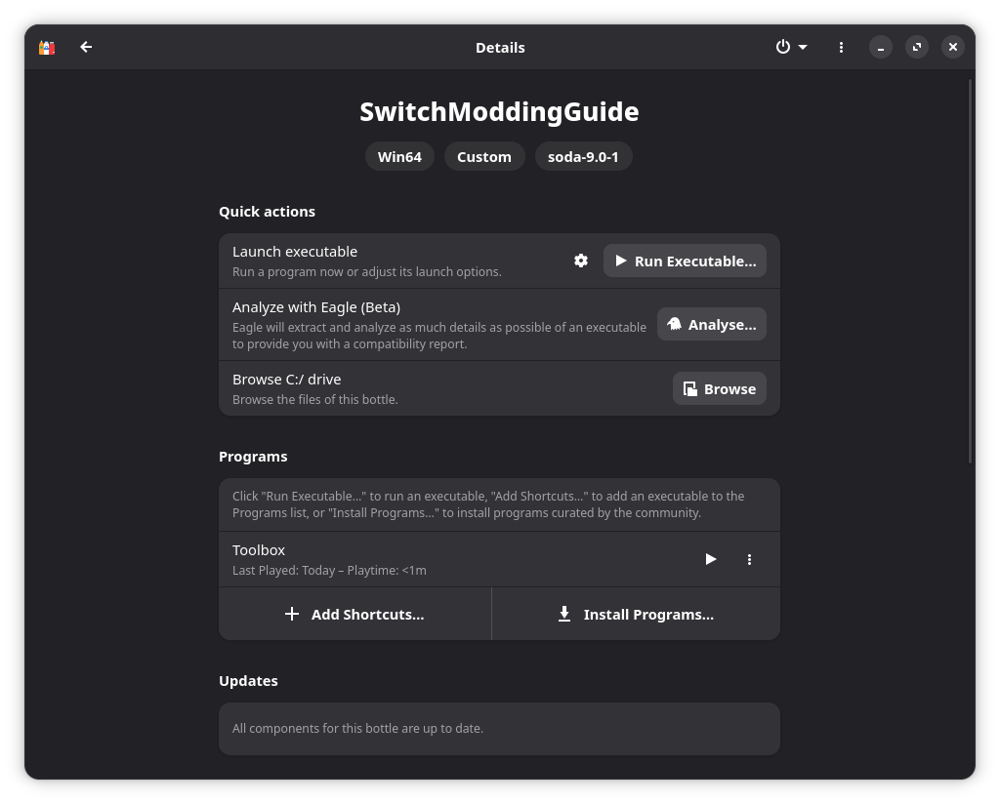

# Running Switch Toolbox on Linux (with Bottles)

[Switch Toolbox](https://github.com/KillzXGaming/Switch-Toolbox/) is a Windows application, but it runs well on Linux using **Bottles**. This guide walks you through setting it up.

## 1. Create a New Bottle

1. Open **Bottles**.
2. Click **+** in the top-left to create a new bottle.
3. Give it a name (e.g. `SwitchModding`).
4. Choose **Custom**, leave Architecture as **64-bit** and Runner as `soda-9.0-1`.
5. Click **Create**.

## 2. Install Dependencies

Once created, click on your new bottle in the list.

1. Scroll down to **Options** → **Dependencies** and click on it.
2. Install the following dependencies in order (this may take a while):
   - `dotnet48`
   - `vcredist2019`
   - `gdiplus`

## 3. Install Switch Toolbox

1. Download the latest release of Switch Toolbox from [GitHub](https://github.com/KillzXGaming/Switch-Toolbox/releases).
   > **Note:** I used the pre-release `Latest Release-v1.0.376`.
2. Extract the archive to a location of your choice.
3. In Bottles, under **Quick Actions**, click **Browse** - this opens your bottle's `drive_c` directory (e.g. `~/.var/app/com.usebottles.bottles/data/bottles/bottles/SwitchModding/drive_c/`).
4. Copy the extracted `Toolbox-Latest` folder into this directory.

## 4. Add a Shortcut & Launch

1. In Bottles, under **Programs**, click **Add Shortcuts...**.
2. Navigate to the `Toolbox-Latest` folder inside `drive_c` and select `Toolbox.exe`.
3. Click the **Play** icon next to Toolbox to run it.

